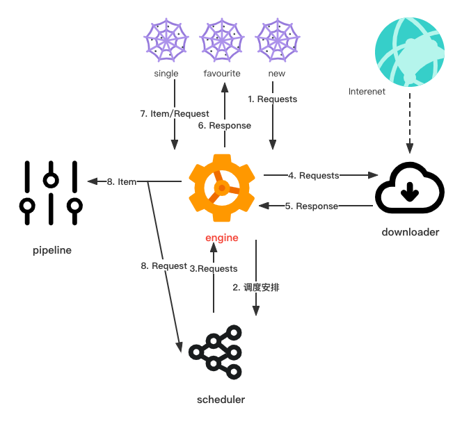

# 基于Scrapy的imdb数据爬取项目——imdb-scrapy

该项目是基于scrapy技术用于获取imdb网站的制定数据。

This project was designed to fetch the specified data on imdb website which based scrapy.

<center>
        
</center>

## 概述
### 文件树
```text
.
├── README.md   # 项目简介
├── imdbSpider # 项目代码文件夹
│   ├── images  # 图片爬取文件夹
│   │   ├── full   #完整图片
│   │   │   
│   │   └── thumbs # 缩略图
│   │       └── format  # 自定义格式图片
│   │       
│   ├── imdbSpider
│   │   ├── __init__.py
│   │   ├── items.py  # item项代码
│   │   ├── middlewares.py  #中间件文件
│   │   ├── pipelines.py # 管道文件
│   │   ├── run.py  # 运行文件
│   │   ├── settings.py  # 设置文件
│   │   └── spiders  # 爬虫代码
│   │       ├── __init__.py
│   │       ├── favourite.py  # 最受欢迎榜单爬虫
│   │       ├── new.py  # 新片爬虫
│   │       └── single.py  # 单部影片爬虫
│   ├── log.txt  # 日志文件
│   └── scrapy.cfg  # 配置文件
└── pic  # 项目图片
    └── scrapy_logo.png
```

### 爬虫文件
业务场景需求主要为三个方面：单影片数据爬去、最受欢迎榜单数据爬取、新片数据爬取，该项目针对该三个方面写了三个爬虫：single，favourite，new。
new与favourite实现较为简单，仅涉及单页面数据爬取。single爬虫数据涉及层级页面的爬取与图像的爬取，稍微比较复杂。


### 主体架构与数据流
项目的主体架构与数据流如下图所示：
<center>
                
</center>

可以看到，scrapy的具体流程为：

- 1. spider 产生requests请求

- 2. engine 处理请求，分配至调度器

- 3. 调度器处理请求安排，传回engine

- 4. engine 将request分发到download中，下载指定资源

- 5. download 将response返回至engine

- 6. engine将response 传回spider

- 7. spider接收response，产生item或者requests

- 8. 若第7步spider产生item，则将item传回pipeline管道

- 9. 若第7步spider产生了request是，则返回3，调度请求

其中，最值得注意的为第8步，在spider处理response时，能产生item或者requests，利用此特性，能够实现层级调度。

## 安装
### 环境要求
```
        Python 2.7/Python 3.6
        Python Package: pip and setuptools. 现在 pip 依赖 setuptools ，如果未安装，则会自动安装 setuptools 。
        lxml. 大多数Linux发行版自带了lxml。如果缺失，请查看http://lxml.de/installation.html
        OpenSSL. 除了Windows(请查看 平台安装指南)之外的系统都已经提供。
        Pillow
```


## 运行
``` shell
# 爬取网页数据
python3 -m scrapy crawl single

# 爬取喜欢榜单
python3 -m scrapy crawl favourite

# 爬取新片榜单
python3 -m scrapy crawl new
```

## 拓展

## TO DO LIST
- [x] Build The Basic Project (22.04.22 ~ 22.04.24)
- [x] Write The Project README (22.04.22 ~ 22.04.24)
- [ ] Expand The Project (22.04.22 ~ 22.04.28)
- [ ] Perfect The *imdb-scrapy*  Repositories (22.04.22 ~ 22.04.30)

## Reference
[1. Mars' Blog](https://wjmars98.github.io/)

[2. 初窥Scrapy](https://scrapy-chs.readthedocs.io/zh_CN/0.24/intro/overview.html)

[3. imdb官网](https://www.imdb.com/)
